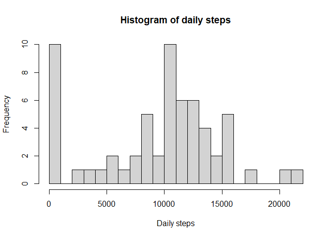
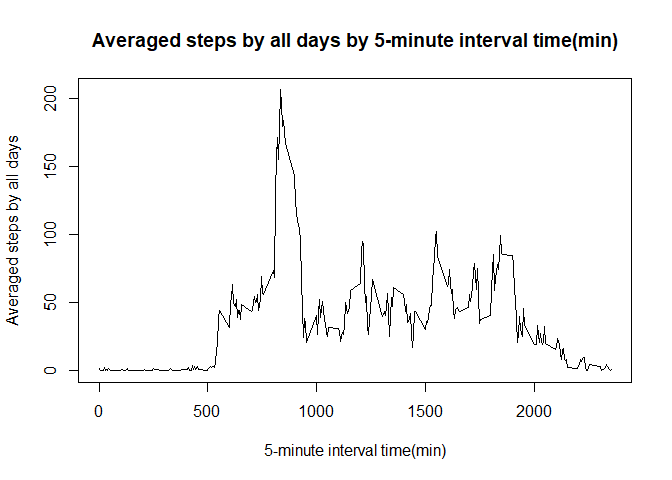
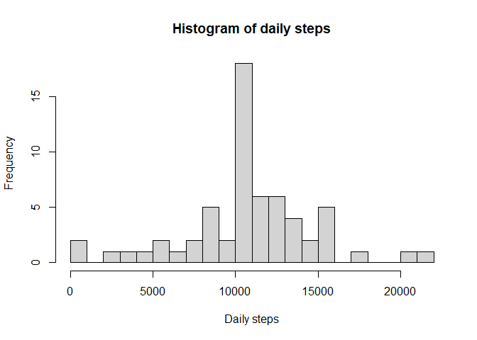
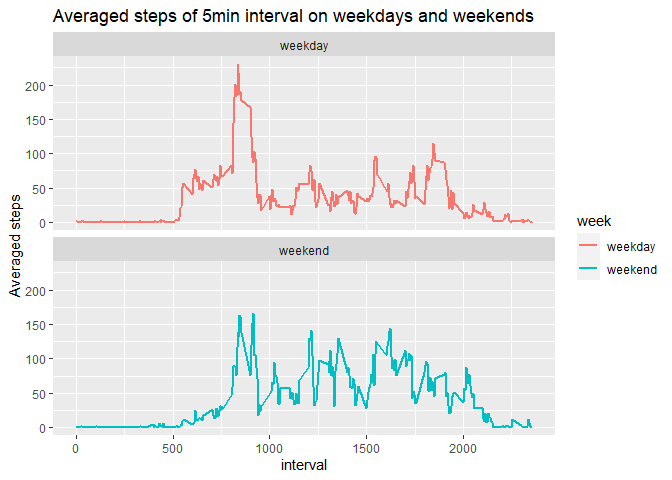

## Introduction
This is the first course project of coursera class: Reproducible Research. Project requirements can be found at 'README.md'. 

## Loading and preprocessing the data
Download the file and unzip it is file doesn't exist previously.

```r
library(ggplot2)
fileUrl <- "https://d396qusza40orc.cloudfront.net/repdata%2Fdata%2Factivity.zip"
fileName <- "repdata_Fdata_Factivity.zip"
if(!file.exists(fileName)){
        download.file(fileUrl, fileName)
}
if(!file.exists("activity.csv")){
        unzip(fileName)
}
```
Reading the csv file and preprocessing it by change value 'NA' into 0.

```r
DT <- read.csv("activity.csv")
DT$date <- as.factor(DT$date)
```

## What is mean total number of steps taken per day?
1. Calculate the total number of steps taken per day

```r
dailySteps <- tapply(DT$steps, INDEX = DT$date, sum, na.rm = TRUE)
head(dailySteps, 10)
```

```
## 2012-10-01 2012-10-02 2012-10-03 2012-10-04 2012-10-05 2012-10-06 2012-10-07 
##          0        126      11352      12116      13294      15420      11015 
## 2012-10-08 2012-10-09 2012-10-10 
##          0      12811       9900
```
2. Make a histogram of the total number of steps taken each day `dailySteps`

```r
hist(dailySteps, main = "Histogram of daily steps", xlab = "Daily steps", breaks = 20)
```

<!-- -->

3. Calculate and report the mean and median of the total number of steps taken per day

```r
mean(dailySteps,na.rm = TRUE); median(dailySteps,na.rm = TRUE)
```

```
## [1] 9354.23
```

```
## [1] 10395
```

## What is the average daily activity pattern?
1. Make a time series plot (i.e. \color{red}{\verb|type = "l"|}type = "l") of the 5-minute interval (x-axis) and the average number of steps taken, averaged across all days (y-axis)

```r
intervalSteps <- as.data.frame.table(tapply(DT$steps, INDEX = DT$interval, mean,na.rm = TRUE))
## Clean and rename dataset intervalSteps
names(intervalSteps) <- c("time", "averagedSteps")
intervalSteps$time<- as.numeric(as.character(intervalSteps$time))
plot(intervalSteps$time, intervalSteps$averagedSteps, type = "l", 
     ylab = "Averaged steps by all days", xlab = "5-minute interval time(min)", 
     main = "Averaged steps by all days by 5-minute interval time(min)")
```

<!-- -->

2. Which 5-minute interval, on average across all the days in the dataset, contains the maximum number of steps?

```r
intervalSteps[intervalSteps$averagedSteps == max(intervalSteps$averagedSteps),]
```

```
##     time averagedSteps
## 104  835      206.1698
```
## Imputing missing values
1. Calculate and report the total number of missing values in the dataset (i.e. the total number of rows with \color{red}{\verb|NA|}NAs)

```r
nrow(DT[is.na(DT$steps),])
```

```
## [1] 2304
```

2. Create a new dataset that is equal to the original dataset but with the missing data filled in.
Here I used the `intervalSteps$averagedSteps` in previous question to replace the missing values.

```r
DTnew <- cbind(DT,intervalSteps$averagedSteps)
DTnew$steps[is.na(DT$steps)] <- DTnew$`intervalSteps$averagedSteps`[is.na(DT$steps)]
DTnew <- DTnew[,-4]
```

3. Make a histogram of the total number of steps taken each day and Calculate and report the mean and median total number of steps taken per day. Do these values differ from the estimates from the first part of the assignment? What is the impact of imputing missing data on the estimates of the total daily number of steps?

```r
dailySteps2 <- tapply(DTnew$steps, INDEX = DTnew$date, sum)
hist(dailySteps2, main = "Histogram of daily steps", xlab = "Daily steps", breaks = 20)
```

<!-- -->

```r
mean(dailySteps2); median(dailySteps2)
```

```
## [1] 10766.19
```

```
## [1] 10766.19
```

Type of Estimate | Mean_Steps | Median_Steps
--- | --- | ---
First Part (with na) | 9354 | 10395
Second Part (fillin in na with mean) | 10766 | 10766

## Are there differences in activity patterns between weekdays and weekends?
1. Create a new factor variable in the dataset with two levels – “weekday” and “weekend” indicating whether a given date is a weekday or weekend day.

```r
DTnew$weekday <- weekdays(as.Date(DTnew$date))
DTnew$week <- "weekday"
DTnew$week[DTnew$weekday == "Saturday"|DTnew$weekday == "Sunday"] <- "weekend"
# DTnew$weekday == "Saturday"|DTnew$weekday == "Sunday"
DTnew <- DTnew[, -4]
head(DTnew, 10)
```

```
##        steps       date interval    week
## 1  1.7169811 2012-10-01        0 weekday
## 2  0.3396226 2012-10-01        5 weekday
## 3  0.1320755 2012-10-01       10 weekday
## 4  0.1509434 2012-10-01       15 weekday
## 5  0.0754717 2012-10-01       20 weekday
## 6  2.0943396 2012-10-01       25 weekday
## 7  0.5283019 2012-10-01       30 weekday
## 8  0.8679245 2012-10-01       35 weekday
## 9  0.0000000 2012-10-01       40 weekday
## 10 1.4716981 2012-10-01       45 weekday
```

2. Make a panel plot containing a time series plot (i.e. \color{red}{\verb|type = "l"|}type = "l") of the 5-minute interval (x-axis) and the average number of steps taken, averaged across all weekday days or weekend days (y-axis).


```r
DTnew$week <- as.factor(DTnew$week)
DTwday <- DTnew[DTnew$week == "weekday",]
DTwend <- DTnew[DTnew$week == "weekend",]
DTwday <- as.data.frame.table(tapply(DTwday$steps, INDEX = DTwday$interval, mean))
DTwend <- as.data.frame.table(tapply(DTwend$steps, INDEX = DTwend$interval, mean))
DTwday$week <- "weekday"
DTwend$week <- "weekend"
DTweek <- rbind(DTwday, DTwend)
names(DTweek) <- c("interval", "Avegsteps", "week")
ggplot(DTweek, aes(x = as.numeric(as.character(interval)), y =Avegsteps))+
        geom_line(size = 1, aes(color = week))+facet_wrap(week~ ., nrow = 2) +
        labs(x = "interval", y = "Averaged steps") + 
        labs(title = "Averaged steps of 5min interval on weekdays and weekends")
```

<!-- -->


